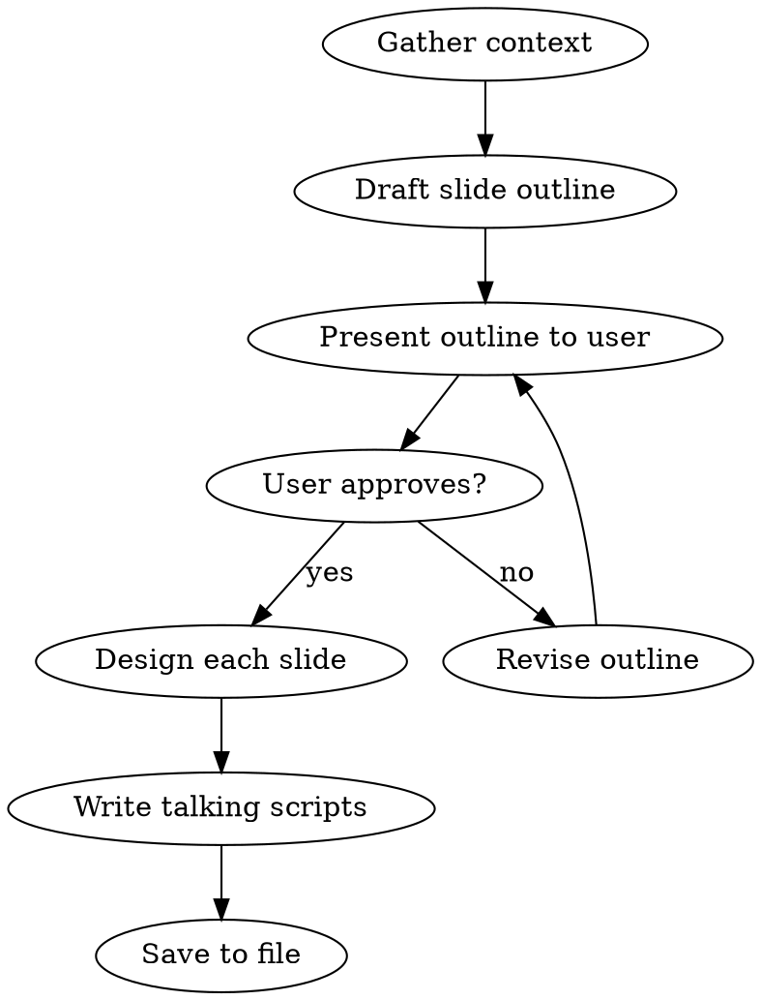

# Slide Design

Design presentation slide decks with visual briefs and verbatim talking scripts. Outputs a single marukdown file that a graphic designer can work from.

## Core Writing Engine

This skill uses [copywrite/SKILL.md](../copywrite/SKILL.md) for voice in the talking scripts. The copywrite skill handles:
- Voice and tone application
- British spelling and language patterns

Talking scripts should sound like Harry presenting on stage. Not reading from notes. Natural, conversational, with his usual dry wit.

## Before Designing

1. **Gather context from the user**:
   - Topic and key message
   - Audience (engineers? managers? mixed?)
   - Duration (5 min lightning talk, 20 min conf talk, 45 min workshop, etc.)
   - Format (live talk, recorded webinar, workshop with exercises)
   - Any must-include content (demos, specific examples, data)

2. **Review the voice guide**: See [VOICE_GUIDE.md](../shared/VOICE_GUIDE.md) for talking script voice

3. **Check business context**: See [BUSINESS_CONTEXT.md](../shared/BUSINESS_CONTEXT.md) for product/audience alignment

## Workflow



### Step 1: Draft a high-level slide outline

Before designing any slides, create a numbered list of slide titles with a one-line description of each. This is the outline. Present it to the user and wait for approval.

**The outline should include:**
- Slide number and title
- One-line description of what the slide covers
- Slide type (infographic or bullets + image)
- Estimated speaking time per slide

**Example outline:**

```
1. Title Slide - Talk title, speaker name, event (bullets + image) [30s]
2. The Problem - Why commercial sim software frustrates engineers (infographic) [2 min]
3. What Is SimPy? - Quick overview, where it fits (bullets + image) [2 min]
4. Live Comparison - Same model, Arena vs SimPy (infographic) [3 min]
...
```

Do NOT proceed to full slide designs until the user confirms the outline.

### Step 2: Design each slide

Each slide is one of two types:

#### Type A: Infographic

A single visual that tells the story. No bullet points. The designer creates the whole thing.

```markdown
## Slide 3: What Actually Happens When You Call env.run()

**Type**: Infographic

**Design Brief**:
Flowchart showing SimPy's event loop. Three swim lanes: "Your Code",
"SimPy Engine", "Event Queue". Show a process yielding a timeout,
the engine scheduling it, the queue ordering it, and the engine
advancing the clock to fire it. Use arrows to show the cycle.
Keep the colour palette minimal (two colours plus grey). Label each
step with plain English, not code. The flow should read left to right.
Approximate dimensions: 16:9 landscape.
```

#### Type B: Bullet Points + Image

Slide has text content on one side and a supporting visual on the other.

```markdown
## Slide 5: Three Things You Need to Know

**Type**: Bullets + Image

**Bullet Points**:
- Environment: your simulation clock
- Process: things that happen over time
- Resource: things that get shared or used up

**Image Brief**:
Simple illustration of a factory floor with three labelled elements:
a wall clock (Environment), a worker assembling parts (Process),
and a shared tool station with a queue (Resource). Friendly,
slightly playful style. Not a screenshot, not a stock photo.
```

### Step 3: Write the talking script

Underneath each slide design, write the verbatim talking script. This is what Harry will actually say while the slide is on screen.

```markdown
**Talking Script**:

Right, so SimPy has three concepts you actually need to care about.
Environment, Process, Resource. That's it. I know the docs make it
look like there's more, but honestly, if you understand these three
you can build 90% of the models I've built for clients.

Environment is just your clock. It tracks simulation time. Process
is anything that happens over time, a customer arriving, a machine
breaking down, whatever. And Resource is anything that gets shared.
Think of it like a tool station where people queue up.

The beautiful thing is that's genuinely all you need to start
building useful models. Not toy examples. Real ones.
```

## Talking Script Guidelines

- Write exactly what Harry would say. Not notes. Not summaries. The actual words.
- Sound like a person presenting, not reading. Contractions, false starts, casual transitions.
- Match the voice guide: witty, direct, British. Dry humour where it fits naturally.
- Vary pacing. Some slides need 30 seconds. Some need 3 minutes. Don't pad short slides or rush complex ones.
- Include natural transitions between slides where they help ("So now that we've got the basics..." or just move on without a transition, both are fine).
- Avoid: "So in this slide we can see..." or "As you can see here..." or any other slide-narration crutch.
- It's fine to reference the visual: "Look at that queue forming on the right" is natural. "As illustrated in the diagram" is not.

## Design Brief Guidelines

Write design briefs that a graphic designer can execute without guessing:

- **Be specific about layout**: left-to-right flow, top-to-bottom hierarchy, side-by-side comparison
- **Describe the visual concept**, not just "an image of X". What style? What emphasis? What should the eye be drawn to first?
- **Specify what to label** and what to leave visual-only
- **Note colour/style constraints** if relevant (match brand, keep minimal, etc.)
- **Include dimensions context**: assume 16:9 slides unless told otherwise
- **For data**: specify whether it's real data (provide it) or illustrative (describe the shape/trend)
- **For code screenshots**: provide the exact code to display, with font size guidance

## Slide Design Principles

- **One idea per slide**. If you're explaining two things, use two slides.
- **Less text is better**. If the audience is reading, they're not listening.
- **Infographics for processes and comparisons**. Bullets for lists and key points.
- **Don't put the talking script on the slide**. The slide supports the talk, it doesn't replace it.
- **Vary the types**. Five bullet slides in a row is numbing. Mix infographics and bullet slides.
- **Opening and closing slides matter most**. Spend extra time on these.
- **Budget time realistically**. A 20-minute talk is roughly 12-18 slides, not 40.

### Rough timing guide

| Duration | Slides | Notes |
|---|---|---|
| 5 min (lightning) | 5-8 | Ruthlessly focused, one key message |
| 20 min (conf talk) | 12-18 | Room for a story arc |
| 45 min (deep dive) | 20-30 | Can include demos/exercises |
| 60 min (workshop) | 15-25 | Fewer slides, more interaction |

## Output Format

Save as a single markdown file with this structure:

```yaml
---
type: slide-deck
status: draft
created: YYYY-MM-DD
topic: Brief description
audience: Who this is for
duration: Estimated duration
total_slides: N
---
```

Then the full slide deck:

```markdown
# [Talk Title]

**Speaker**: Harry
**Event**: [Event name if known]
**Duration**: [X minutes]

---

## Slide 1: [Title]

**Type**: Bullets + Image | Infographic

[Slide content as described above]

**Talking Script**:

[Verbatim script]

---

## Slide 2: [Title]

...
```

Use `---` (horizontal rule) between slides for visual separation.

**Output location**: `posts/slides/{topic-slug}.md`

## Quality Checklist

Before delivering, verify:

- [ ] High-level outline was approved by user before full design
- [ ] Every slide is clearly typed (infographic or bullets + image)
- [ ] Design briefs are specific enough for a designer to execute without questions
- [ ] Every slide has a verbatim talking script underneath
- [ ] Talking scripts sound like Harry presenting (not reading, not narrating slides)
- [ ] One idea per slide (no overloaded slides)
- [ ] Mix of infographic and bullet slides (not all one type)
- [ ] Total slide count is realistic for the duration
- [ ] Timing adds up roughly to the target duration
- [ ] British spellings throughout
- [ ] No corporate jargon in scripts or bullet points
- [ ] Opening slide grabs attention, closing slide lands the message
