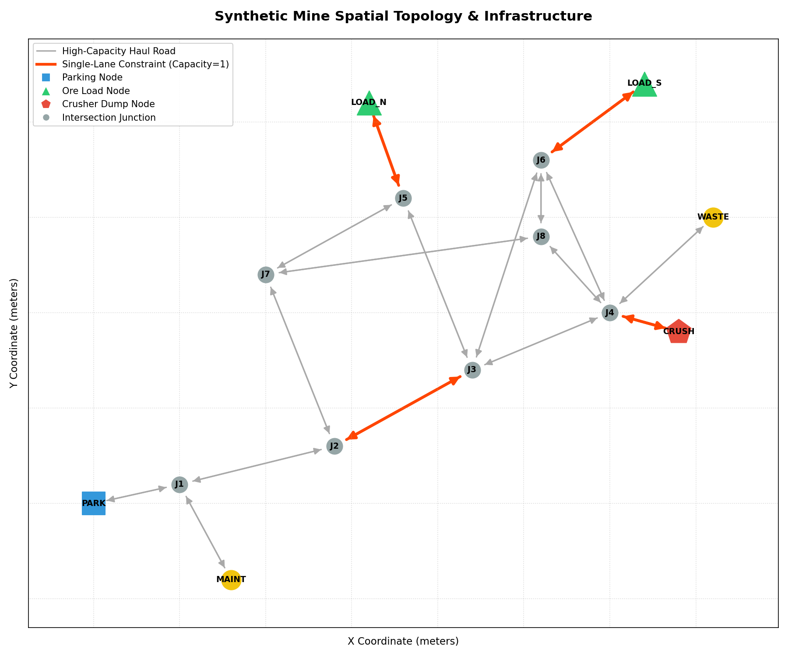
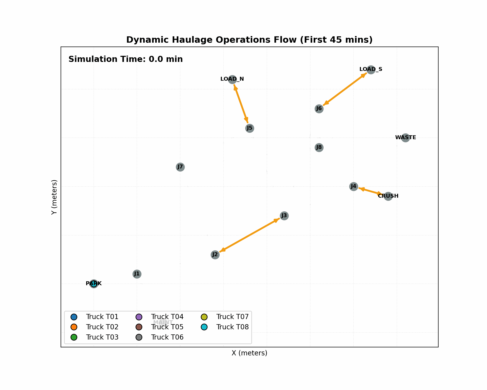

# Synthetic Mine Throughput Simulation — 8-Hour Shift Haulage Analysis

This project implements a high-fidelity, discrete-event simulation (DES) using **SimPy** to model and analyze a synthetic mine's haulage network. The simulation estimates ore throughput to the primary crusher over an 8-hour shift, evaluates system bottlenecks, and conducts sensitivity analyses across 7 operational scenarios using 30 randomized replications each.

---

## 📸 Spatial Layout & Simulation Traffic Flow

### Static Mine Topology
The mine's physical road network consists of directed edges connecting the starting parking area (`PARK`), loader faces (`LOAD_N` in North Pit and `LOAD_S` in South Pit), junctions, and the primary crusher (`CRUSH`). The single-lane main ramp (`E03_UP` and `E03_DOWN`) is capacity-constrained (capacity = 1).



### Dynamic Traffic Flow Animation (First 45 Minutes of Shift)
The animation below shows empty trucks (blue) and loaded trucks (red) traveling, queueing, and servicing at the loaders and crusher. It visually verifies queueing behavior, single-lane ramp contention, and empty/loaded routing paths.



---

## 🚀 Getting Started

### 1. Installation
This simulation requires Python 3.8+ and uses standard scientific and network analysis libraries. You can install all dependencies via `pip`:

```bash
pip install simpy numpy pandas scipy matplotlib networkx pyyaml
```

### 2. Running the Simulation
To run all 7 scenarios across 30 replications and generate the outputs, execute the following command from the workspace root:

```bash
PYTHONPATH=src python3 -m mine_sim
```

This will run the entire suite of 210 simulation runs and output:
- `results.csv`: Scenario-level and replication-level metrics (throughput, utilizations, queue times).
- `summary.json`: Aggregated summary statistics with 95% confidence intervals and bottleneck rankings.
- `event_log.csv`: High-resolution trace of every simulation event (travel, edge queues, loading, dumping).
- `topology.png`: Spatial map of the mine network.
- `animation.gif`: Traffic flow animation of the first 45 minutes.

### 3. Model Correctness Validation
To verify that the simulation outputs strictly adhere to physical constraints (e.g., no simultaneous occupancy of capacity-1 single-lane road segments, hard 480-minute shift cutoff, and mathematical consistency in throughput accounting), run:

```bash
PYTHONPATH=src python3 -m mine_sim --validate
```

---

## 📊 Core Scenario Results

The simulation conducted **30 independent replications** for each scenario using randomized seed control (`seed = base_random_seed + replication_index`) to ensure statistical validity. 95% confidence intervals (CI) were calculated using a Student-t distribution with 29 degrees of freedom ($df = N - 1$).

### Summary Table

| Scenario ID | Fleet Size | Key Operational Change | Total Tonnes Mean | 95% Confidence Interval | Tonnes per Hour (TPH) | Avg Cycle Time (min) | Truck Util. | Crusher Util. | North Pit Loader Util. | South Pit Loader Util. |
| :--- | :---: | :--- | :---: | :---: | :---: | :---: | :---: | :---: | :---: | :---: |
| **`baseline`** | 8 | Standard configuration | **12,503.33** | [12,416.46, 12,590.21] | 1,562.92 | 29.76 | 77.61% | 91.55% | 60.45% | 80.43% |
| **`trucks_4`** | 4 | Low fleet size sensitivity | **7,623.33** | [7,594.44, 7,652.23] | 952.92 | 24.49 | 92.82% | 56.29% | 32.16% | 51.26% |
| **`trucks_12`** | 12 | High fleet size sensitivity | **12,896.67** | [12,810.35, 12,982.98] | 1,612.08 | 42.67 | 54.84% | 94.15% | 64.28% | 85.02% |
| **`ramp_upgrade`** | 8 | Main narrow ramp upgrade | **12,556.67** | [12,488.25, 12,625.09] | 1,569.58 | 29.66 | 77.65% | 91.85% | 61.05% | 80.97% |
| **`crusher_slowdown`**| 8 | Slower crusher service | **6,530.00** | [6,455.22, 6,604.78] | 816.25 | 55.29 | 48.95% | 95.51% | 33.60% | 44.09% |
| **`ramp_closed`** | 8 | Main ramp closed, detour | **12,393.33** | [12,341.51, 12,445.16] | 1,549.17 | 30.04 | 77.07% | 90.24% | 66.04% | 75.25% |
| **`trucks_12_ramp_upgrade`** | 12 | Fleet + Ramp Combo | **12,876.67** | [12,790.24, 12,963.10] | 1,609.58 | 42.72 | 54.67% | 94.70% | 64.67% | 85.12% |

---

## 🎯 Answers to Operational Decision Questions

### 1. Expected Baseline Throughput
* **Expected Throughput**: **12,503.33 tonnes** (95% CI: **[12,416.46, 12,590.21]**), averaging **1,562.92 tonnes per hour (TPH)**.
* **Interpretation**: In an ordinary shift, the current 8-truck fleet performs robustly, but operates close to physical system limits, primarily bound by crusher cycle limitations.

### 2. Likely Bottlenecks in the Haulage System
* **Primary Bottleneck**: The **Primary Crusher (`D_CRUSH`)**. It has a baseline utilization of **91.55%** and a mean queue wait time of **3.34 minutes** (Composite Bottleneck Rank Score = **3.06**, the highest in the system). 
* **Secondary Bottleneck**: The **South Pit Loader (`L_S`)**. Even though it has a faster mean load time (4.5 min vs. 6.5 min at L_N), its high desirability draws a larger share of truck arrivals, keeping it **80.43% utilized** with a mean queue wait time of **2.46 minutes** (Composite Rank Score = **1.98**).
* **Physical Constraint (The Main Ramp)**: The single-lane narrow ramp (`E03_UP`) is a severe localized bottleneck. While its average hourly utilization is low (~5.3%), when conflict arises, empty and loaded trucks must queue, suffering a massive average wait time of **10.86 minutes** at the entrance of the segment before traversal.

### 3. Impact of Fleet Size: Adding More Trucks vs. Saturation
* **Finding**: The system **saturates rapidly** beyond 8 trucks.
* **Analysis**: 
  * Reducing the fleet to 4 trucks (`trucks_4`) drops throughput by **39.0%** to **7,623.33 tonnes** because the crusher (56.29% utilization) and loaders are starved of material. Here, truck utilization is very high (**92.82%**) and queues are minimal (~0.7 min).
  * Increasing the fleet to 12 trucks (`trucks_12`) only yields a minor **3.1%** increase to **12,896.67 tonnes**. 
  * **The Saturation Trap**: Adding these 4 extra trucks causes average cycle time to balloon from 29.76 minutes to **42.67 minutes** (a **+43.4% increase**), and truck utilization falls to **54.84%**. This is because trucks spend on average **14.25 minutes** waiting in queue at the primary crusher (a **+325% increase** from baseline), confirming the crusher is completely saturated.

### 4. Narrow Ramp Upgrade Operational Impact
* **Finding**: Upgrading the narrow main ramp alone (`ramp_upgrade`) does **not** materially improve throughput.
* **Analysis**: Throughput increases by a negligible **0.43%** to **12,556.67 tonnes**. Because the primary crusher and loaders remain highly constrained, eliminating the narrow-ramp bottleneck simply shifts the queues downstream to the crusher and loader queues. 
* Even when combining 12 trucks and the ramp upgrade (`trucks_12_ramp_upgrade`), the throughput (**12,876.67 tonnes**) remains essentially identical to the standard 12-truck scenario. Without expanding the primary crusher's hopper or processing rate, upstream road upgrades are an ineffective capital expenditure.

### 5. Sensitivity of Throughput to Crusher Service Time
* **Finding**: Throughput is **extremely sensitive** to crusher service time.
* **Analysis**: In the `crusher_slowdown` scenario (where crusher service time mean doubles to 7.0 minutes), the shift's throughput is cut nearly in half, plummets by **47.8%** to **6,530.00 tonnes** (816.25 TPH). 
* The crusher operates at near-continuous utilization (**95.51%**), while average truck queue wait at the crusher explodes to **26.48 minutes**. Trucks spend more time waiting at the crusher than hauling, dropping average truck utilization to **48.95%**. This underscores that crusher reliability, maintenance, and speed are the most critical factors for mine output.

### 6. Operational Impact of Losing the Main Ramp Route
* **Finding**: Losing the main ramp route has a **surprisingly minor impact** on throughput.
* **Analysis**: Closing the main ramp (`ramp_closed`) only decreases shift throughput by **0.88%** to **12,393.33 tonnes** (from 12,503.33 tonnes in baseline).
* **The Detour Paradox**: While trucks are forced to take the bypass detour (`E04_UP` / `E04_DOWN`), the bypass roads are multi-lane (capacity = 999). This completely eliminates the single-lane capacity conflicts and the resulting **10.86-minute** narrow ramp queue waits. The elimination of ramp queuing almost perfectly offsets the minor travel time delay of the bypass detour, proving that the single-lane "main ramp" is actually an operational liability compared to a multi-lane bypass.

---

## 🧠 Conceptual Model Design

The conceptual design of our model is thoroughly documented in [`conceptual_model.md`](conceptual_model.md). Key pillars include:

### 1. System Boundary
- **Included**: Active truck fleet, material loading resources (North & South loaders), material dumping resource (crusher), directed physical network, single-lane road bottlenecks (capacity-1 edges), stochastic loading, travel, and dumping, and dynamic truck dispatching.
- **Excluded**: Overburden waste hauling (`WASTE`), maintenance workshop routing (`MAINT`), refueling, equipment mechanical breakdowns, and shift-change ramping delays.

### 2. Modeling Assumptions
- **Travel Stochasticity**: Base travel times are calculated from shortest paths on free-flow speeds. Travel durations on each edge traversal are subject to lognormal noise ($\text{CV} = 0.10$) to preserve positive travel times:
  $$\sigma_{\log} = \sqrt{\ln(1 + \text{CV}^2)}, \quad \mu_{\log} = \ln(T_{\text{base}}) - \frac{1}{2}\sigma_{\log}^2$$
- **Service Stochasticity**: Loading and dumping service times are modeled as normal distributions truncated at a minimum of 0.1 minutes to prevent physical impossibilities:
  $$T_{\text{service}} = \max(0.1, \mathcal{N}(\mu, \sigma^2))$$
- **Routing**: Shortest-time routes are computed using NetworkX's Dijkstra solver based on free-flow speeds and dynamic edge states (e.g., excluding closed edges during `ramp_closed`).

### 3. Routing & Dispatching Heuristic
To maximize haulage efficiency, trucks do not have a fixed loader assignment. Instead, empty trucks are dynamically dispatched at the start of empty travel using a multi-factor score that minimizes expected completion time (travel empty time + queue delay at loader + loader service time):
$$\text{Score}(L) = T_{\text{travel\_empty}}(\text{current}, L) + \left( Q(L) \times \mu_{\text{load}, L} \right) + \mu_{\text{load}, L}$$
where:
- $T_{\text{travel\_empty}}(\text{current}, L)$ is the shortest path travel time from the truck's current node to loader face $L$.
- $Q(L)$ is the current number of trucks in queue and in service at loader $L$.
- $\mu_{\text{load}, L}$ is the mean load time of loader $L$.

The truck is assigned to the loader $L \in \{\text{LOAD\_N}, \text{LOAD\_S}\}$ that achieves the minimum score.

---

## 🛠️ Model Limitations & Future Work

1. **No Overtaking on Multi-Lane Roads**: The model assumes that on capacity-999 roads, trucks travel at free-flow speeds (subject only to lognormal noise) regardless of local traffic density. An extension could introduce a density-dependent speed-flow relationship.
2. **Infinite Crusher Hopper Capacity**: It is assumed that the primary crusher hopper has infinite stockpile capacity and never overflows or stops downstream processing. Incorporating a dynamic hopper level constraint would capture plant-matching constraints.
3. **No Breakdowns or Refueling**: Equipment mechanical failures and diesel refueling are omitted. Integrating mean time between failures (MTBF) and mean time to repair (MTTR) would provide a more conservative, realistic long-term throughput estimate.
